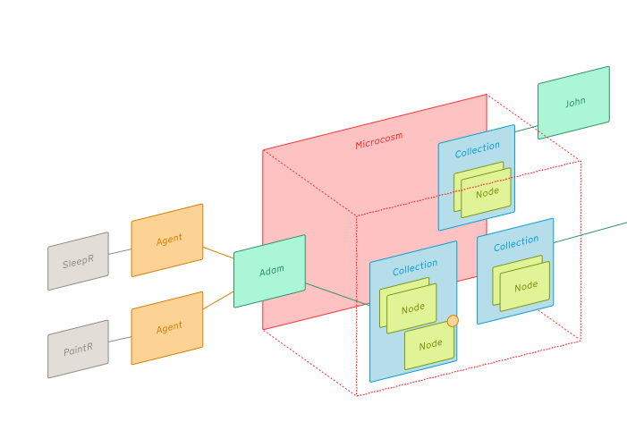

> [!NOTE] Agents are being defined and are at an early draft stage

## What is an Agent?

- An **Agent** is an entity that you can use to hook into the nodenogg.in app, allowing external tools and systems the ability to view and add **Nodes** to the **Microcosms**on a specific person's behalf.
- Permission for an **Agent** to access a **Microcosm** is always granted to a specific **Identity**.
- When an **Agent** edits a **Microcosm**, the agent-generated content is marked as such.

### Permissions (WIP)

- `read`: the **Agent** can view all the **Nodes** in its parent Identity's **Collection**.
- `read:all`: the **Agent** can view all the **Nodes** that its parent Identity can view
- `add:all`: the **Agent** can add all types of **Node** to the **Microcosm** on its parent's behalf
- `add:<type>`: the **Agent** can add a **Node** of a specific `type` (e.g. `html`) to the **Microcosm**

## Example agents

### SleepR

- WIP

### PaintR

- WIP
