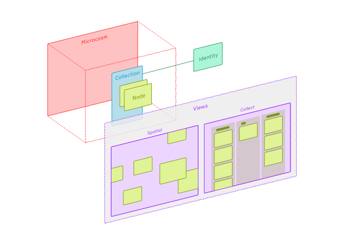

## What is a View?

- A **View** is a template for how people can interact with **Nodes**, **Collections** and **Microcosms**.
- The **Microcosm** provides the data. It's up to the **View** to decide how to present it.

## Exploring different Views

The research question we are looking to answer is whether students and users might benefit from being able to choose from applying different lenses to collaborative creative work. Digital whiteboards have a tendency to go stale. That's not necessarily a bad thing! They are a snapshot of a point in time, and are a milestone on the way to a wider creative goal.

The default view is the single player 'collect' view this allows you to focus on your comments without distraction and to provide fast feedback

The most comlpex and 'large screen'' view is the 'spatial' view and is probably the one that feels most familiar. However it's important that nodenogg.in feels like **more than just a whiteboard app**. Whiteboard apps can sometimes ignore that the data added in the form of post-it notes, drawings and other media is richly semantic. We want to use the **View** concept to make it easier for people to consider their digital ideas from different perspectives.

Whilst we are trying to make our spatial canvas as good as possible, there are other apps that are actually much better at that specific job. For example like [Excalidraw](https://excalidraw.com/).

[TLDraw](https://www.tldraw.com/), [Whimsical](https://whimsical.com/) and [Obsidian's Canvas mode](https://obsidian.md/canvas) are also excellent and stand out as fantastic commercial projects that are free to use.

#### See also

- Amelia Wattenberger's [exploration into infinite canvases](https://twitter.com/Wattenberger/status/1641121948716642304) has a lot of wonderful ideas and identifies some of the same opportunities and gaps in how we think about spatial canvases.
