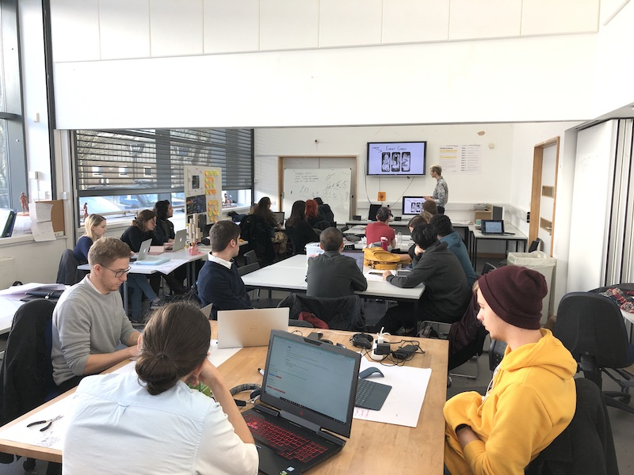

nodenogg.in is a tool that increases participation in feedback and critiques. It is deliberately made to improve student and staff confidence, project outcomes and enhance a community of practice.

nodenogg.in was designed with privacy in mind, to be simple and quick to use.

nodenogg.in supports your education practice by using networked technologies to enhance social learning spaces.

nodenogg.in embraces text only input, coupled with multi views to foster inclusive, fast and intuitive feedback.

nodenogg.in is radical in it’s simplicity and focus on practice based pedagogy.

nodenogg.in was created to embrace the wonderful slowness of human thought.

nodenogg.in is purposefully small.

