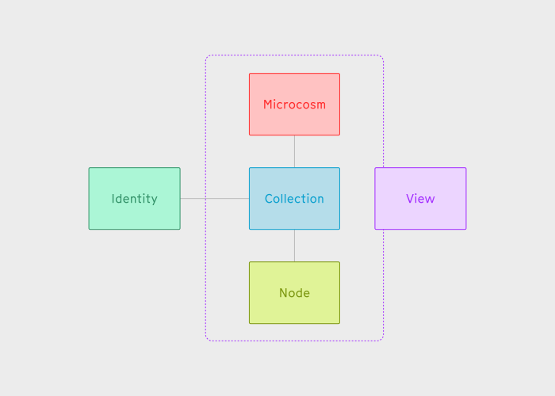
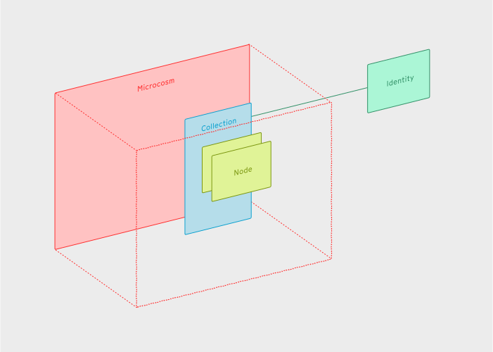
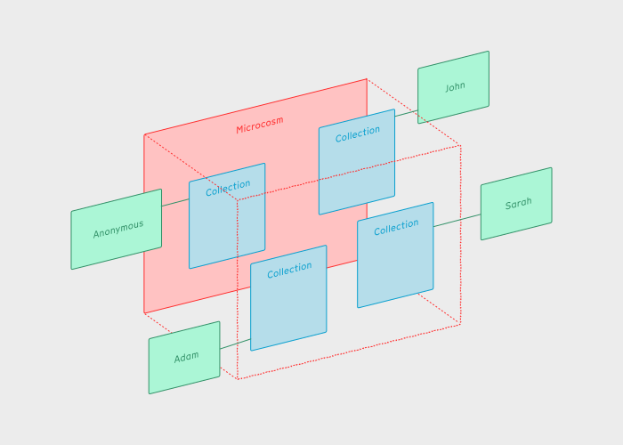
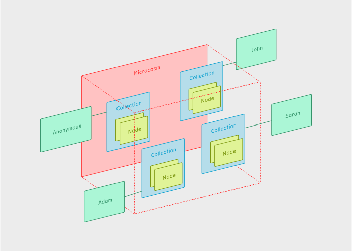
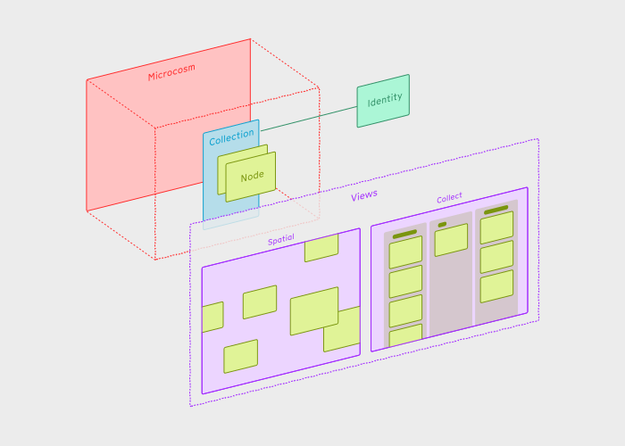
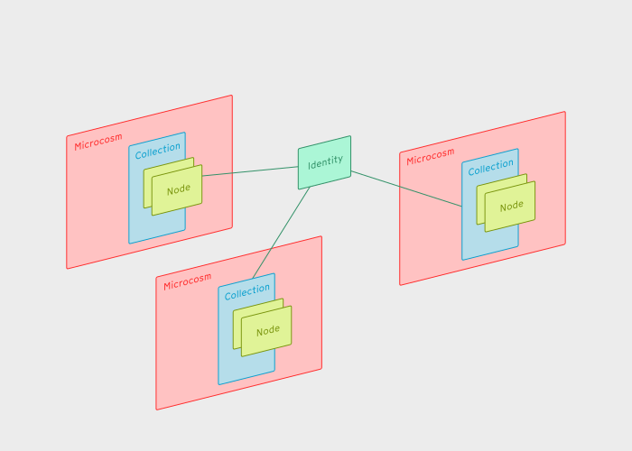
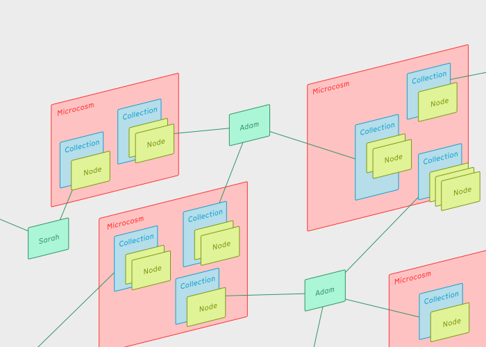

For those who are new to nodenogg.in and want to understand more about how it works: here are some things that are useful to think about.

### Five key concepts

### Microcosm

A **Microcosm** is a space where you can collaborate and share with others. They are a bit more like channels (e.g. `#announcements` in a Discord server) rather than documents or files. If you have the right URL, you can join and contribute to the **Microcosm**. Any one who has the same URL can also join add their own **Nodes**.

- If you want, you can add a password which means that only people using that same password will be able to view what you add to the **Microcosm**.

### Collection

Each **Microcosm** contains a set of **Collections**. Each person gets their own **Collection** within a **Microcosm** when they first join.

- **Microcosms** don't necessarily need to be shared. You can keep them private, in which case it only contains one **Collection** associated with your **Identity**.
- People are anonymous by default, but they can choose to add a user name if they like. See [identity](#identity).

### Node

**Nodes** are the building blocks of content that you can add to your collection in the **Microcosm**. There are different types of **Node**.

#### `HTMLNode`

This contains `<html>` markup and is used for displaying text and rich media **Nodes**.

#### `ConnectionNode`

This describes a connection that someone has made between two `HTMLNodes`.

#### `EmojiNode`

This as you might guess, an emoji that someone can use to react to other content in the **Microcosm**.

#### `SVGNode`

This contains a diagram or drawing.

### View

A **View** are how people can interact with **Nodes**, **Collections** and **Microcosms**. For example, the main and most sophisticated one is the spatial view, which is a panning infinite canvas and whiteboard. Our plan is that as the project matures, you'll be able to choose different views depending on the activities you're doing and the questions you're interested in.

### Identity

An **Identity** is a unique token that is created for each user of the app. When someone joins a **Microcosm**, they are given their own **Collection** named with their ID. A user in this sense might be an individual or small group, it might be a throwaway account. **Identities** are deliberately designed to be very lightweight and easy to replace.

Your **Identity** can travel with you between different microcosms. You might have more than one if you like to use more than one device.

- Although the implementation is in progress, the plan is that **Identities** are made from a unique cryptographic key pair.
- **Identities** are created when someone visits a browser for the first time.
- **Identities** are portable, meaning they can be saved in a text file and imported into other browsers and devices.
