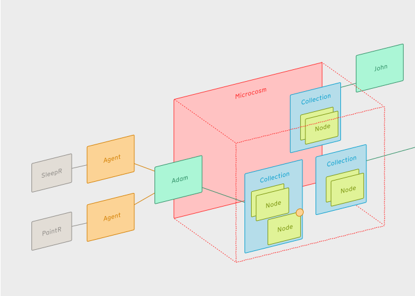

:::note
**Agents** are being defined and are at an early draft stage
:::

## What is an Agent?

- A **Agent** is a plugin system for hooking into the nodenogg.in app, allowing external tools and systems the ability to view and add **Nodes** to the **Microcosms**on a specific person's behalf.
- Permission for an **Agent** to access a **Microcosm** is always granted to a specific **Identity**.
- When an **Agent** edits a **Microcosm**, the agent-generated content is marked as such.

## Example agents

### SleepR

- WIP

### PaintR

- WIP
