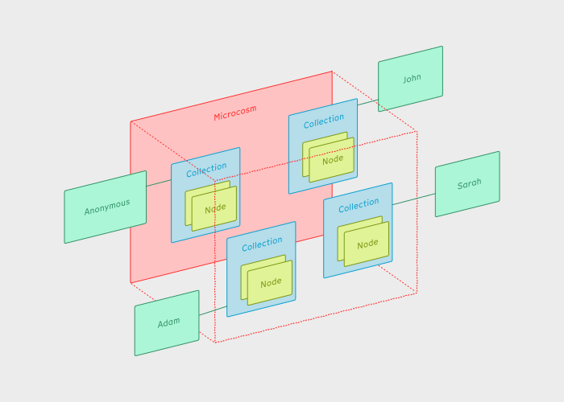

## Five key concepts

There are five key concepts to think about with data in the nodenogg.in app.

### Microcosm

A **Microcosm** is a space where you can collaborate and share with others. They are a bit more like channels (e.g. `#announcements` in a Discord server) rather than documents or files. If you have the right URL, you can join and contribute to the **Microcosm**. Any one who has the same URL can also join add their own **Nodes**.

- If you want, you can add a password which means that only people using that same password will be able to view what you add to the **Microcosm**.

### Collection

There is a set of **Collections** in each **Microcosm**. Each person gets their own **Collection** within a **Microcosm** when they first join.

- People are anonymous by default, but they can choose to add a user name if they like. See [identity](#identity).

### Node

**Nodes** are the building blocks of content that you can add to your collection in the **Microcosm**. There are different types of **Node**.

#### `HTMLNode`

This contains `<html>` markup and is used for displaying text and rich media **Nodes**.

#### `ConnectionNode`

This describes a connection that someone has made between two `HTMLNodes`.

#### `EmojiNode`

This as you might guess, an emoji that someone can use to react to other content in the **Microcosm**.

#### `SVGNode`

This contains a diagram or drawing.

### View

A **View** are how people can interact with **Nodes**, **Collections** and **Microcosms**. For example, the main and most sophisticated one is the spatial view, which is a panning infinite canvas and whiteboard. Our plan is that as the project matures, you'll be able to choose different views depending on the activities you're doing and the questions you're interested in.

### Identity

An **Identity** is a unique identifier that is used to identify a user of the app. When someone joins a **Microcosm**, they are given their own **Collection** named with their UUID.

- Although the implementation is in progress, the plan is that **Identities** are made from a unique cryptographic key pair.
- **Identities** are created when someone visits a browser for the first time.
- **Identities** are portable, meaning they can be saved in a text file and imported into other browsers and devices.

